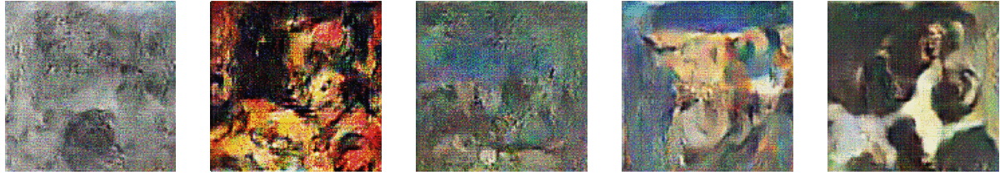

# Generating Abstract Art using Deep convolutional generative adversarial networks
### In this project I have generated abstract by training DC_GAN model with aprrox 8500 paintings



You can generate any kind of figure using this

### to use this 

make sure each image have same **height x width**

you can use this

**`mogrify -path /path/to/store_output/ -resize 200x200^ -gravity Center -extent 200x200 /path/to/source/*.jpg`**

```python
INPUT_DATA_DIR = "/tf/DC_GAN/art_dataset/" # Path to the folder with your inputs
```

### Tunning parameters

Change the parameters according to your need

```python
# Hyperparameters
NOISE_SIZE = 100
LR_D = 0.00004
LR_G = 0.0004
BATCH_SIZE = 64
EPOCHS = 300
BETA1 = 0.5
WEIGHT_INIT_STDDEV = 0.02
EPSILON = 0.00005
SAMPLES_TO_SHOW = 5
```
### Tunning OpenCV

Change the interpolations in openCV eg.RGB,HSV

```python
input_images = np.asarray([np.asarray(cv2.cvtColor(cv2.resize(cv2.imread(file),(128,128)), cv2.COLOR_BGR2RGB)) for file in glob(INPUT_DATA_DIR + '*')])
```


### show samples along with ongoing training

```python
sample_images = random.sample(list(input_images), SAMPLES_TO_SHOW)
show_samples(sample_images, OUTPUT_DIR + "inputs", 0)
```

### Start training
```python
with tf.Graph().as_default():
    train(get_batches(input_images), input_images.shape)
```


